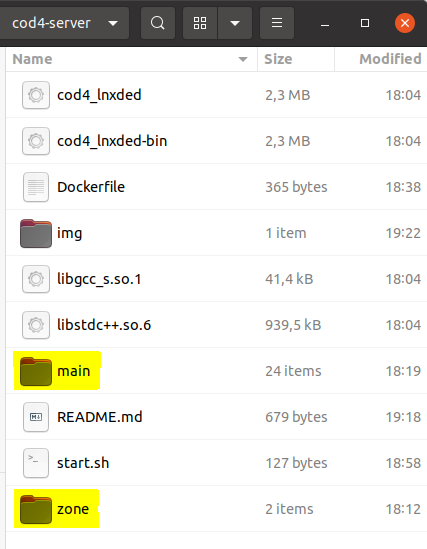

# cod4-server

Dockerized server for Call of Duty 4 Modern Warfare. Minimizes setup process and server handling to focus on gaming :)

## Prerequisites

1. [Docker](https://www.docker.com/)

2. Call of Duty 4 Modern Warfare game files

## Setup

### 1) Add game files

Copy game files (directories main/ & zone/) to repository root.

### 2) Edit server config (optional)

Edit server.cfg in /main/server_config to fit your needs.
This step is not mandatory as the provided file already contains a valid configuration.

### 3) Run in Docker

Open terminal, switch to repository directory and execute the following (pick only one of the run commands):

Build image:

    docker build -t luisnaldo7/cod4-server:latest .

Run container:

    docker run -d -p 28960:28960 --rm --network=host --name cod4-server luisnaldo7/cod4-server:latest

Run container (always on boot):

    docker run -d -p 28960:28960 --restart always --network=host --name cod4-server luisnaldo7/cod4-server:latest

## Credits

Thanks to Takiry providing basic installatin guide. An explenation video (German) can be found here: https://www.youtube.com/watch?v=GrvV2_UZV4w

